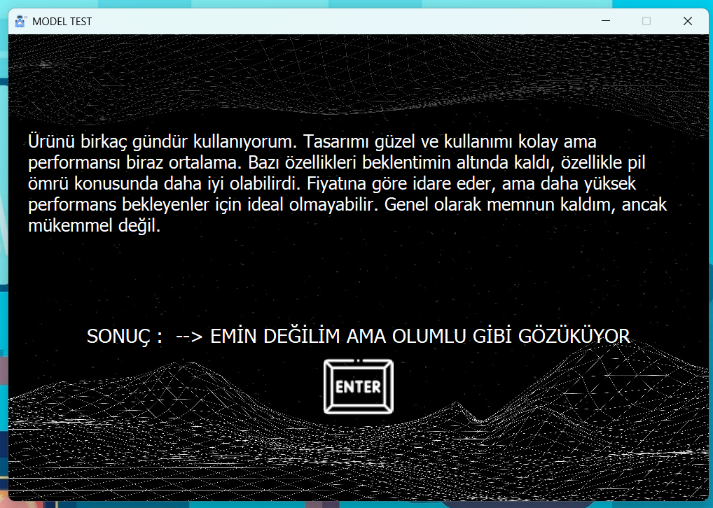

# Rate-AI: AI-Powered Review Analysis System

## About the Project
Rate-AI is a system that provides more accurate and consistent ratings by analyzing product reviews using artificial intelligence technology. Initially developed and optimized for Turkish language processing, the model excels at analyzing Turkish customer reviews and ratings. The project was created to address the common inconsistencies between written reviews and numerical ratings in Turkish e-commerce platforms and review sites.

  

    
    
  

  

    
  

## Features

### Model Test Interface
- Allows users to test model accuracy
- Offers 7 different evaluation categories:
  - Definitely positive/negative
  - Positive/negative
  - Not sure but seems positive/negative
  - Undecided

### Analysis Engine
- Performs batch review analysis quickly and effectively
- Provides percentage-based general evaluation
- Stores analysis results in database
- Enables quick access for repeated analyses

### Rating System
- 1-5 star rating evaluation for each review
- Export results in CSV format
- User-friendly visualization interface

## Technical Details

### Data Collection Process
- Web scraping technologies: requests and BeautifulSoup4

#### Movie Data Collection Algorithm
- Systematic film ID scanning
- Automatic review and rating matching
- Efficient data storage and management
- Interruption-resistant data collection mechanism

#### Market Data Collection Algorithm
- Page-based rating system
- Balanced dataset creation strategy
- Database integration

## Development Potential
- Product category-specific analysis models
- Integration of more advanced NLP models
- Improving model accuracy with ready-to-use datasets

## Resources
- [Project Demo Videos](https://drive.google.com/drive/folders/1GmojXNA15YhoXZ7ysJKeXapwkATJ0xSp?usp=sharing)
- [Movie Dataset](https://drive.google.com/file/d/1GpHxgiCukb5Lki76eWk072YjRBoUpXlG/view?usp=sharing)
- [Market Dataset](https://drive.google.com/file/d/1k_6Bu4yLYaphWyZCK6ERaXh96bwoBFLz/view?usp=sharing)

## Technical Requirements

| Technology   | Version |
|--------------|---------|
| Python       | 3.9     |
| TensorFlow   | 2.10.0  |
| CUDA         | 11.8    |
| CuDNN        | 8.6     |
| SQLite       | 3.32.3  |
| PyQt5        | 5.15.11 |

### Installation Requirements
- NVIDIA GPU (for CUDA support)
- Minimum 4GB RAM
- Windows/Linux operating system

## License
This project is licensed under the MIT License. See the [LICENSE](LICENSE.txt) file for more details.